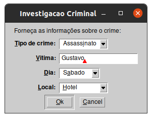
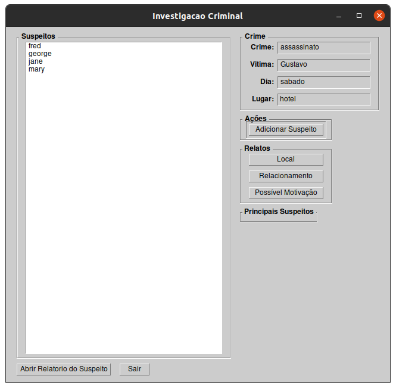
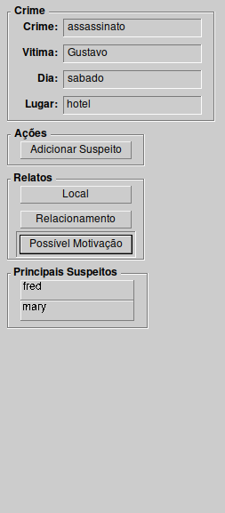
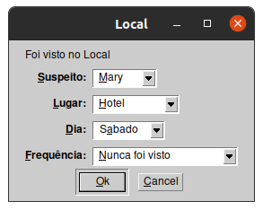

# Investigação  Criminal

**Disciplina**: FGA0210 - PARADIGMAS DE PROGRAMAÇÃO - T01  
**Nro do Grupo**: 05  
**Paradigma**: Lógico  

## Alunos

|Matrícula | Aluno |
| -- | -- |
| 16/0049458  | Eduardo Lima Ribeiro |
| 17/0070735  | Lucas Maciel Aguiar  |

## Sobre

O projeto consiste em um sistema simples de avaliação de fatos e relatos para se concluir entre os suspeitos identificados quem provavelmente cometeu o crime.

O sistema se baseia em regras bem simples definidas no código e que podem não representar verdadeiramente um comportamento no mundo real. As regras estão definidas nos arquivos 'regras.pl' e os fatos no arquivo 'base_dados.pl' que podem ser alterados para se realizar uma avaliação mais precisa.

## Screenshots

### Dialogo de informações do crime

### Tela Principal

### Menu lateral

* Informações sobre o crime atual sendo avaliado, formulários para relatar sobre algum suspeito e o resultado atual

### Formulários

* Os formulários servem para adicionar relatos sobre os suspeitos

### Relatório baseado em relatos

* Pode ser acessado quando se seleciona em um __suspeito__ na lista e clica no botão inferior __Abrir Relatorio do Suspeito__
* Nele são apenas listados os relatos que tem alguma ligação com o crime, por exemplo: Crime ocorreu no Sábado no Hotel, se alguém relatar que um suspeito foi visto na Segunda no Parque, esse relato não será considerado

## Instalação

**Linguagens**: Prolog  
**Tecnologias**: XPCE  
**Dependências**: Testado somente no SWI-Prolog versão 8.2.1 para linux, pode não funcionar corretamente em Sistemas Operacionais que não são baseados no Linux

## Uso

Certifique-se que a sua máquina tenha o SWI-Prolog versão 8.2.1-1 ou superior instalado corretamente, juntamente com o pacote XPCE, que vêm com a maioria das instalações.
Abra o terminal ou seu equivalente em seu sistema operacional e digite os seguintes comandos:

    git clone https://github.com/UnBParadigmas/2020.1_G5_Logico_InvestigacaoCriminal
    cd 2020.1_G5_Logico_InvestigacaoCriminal/
    swipl main.pl
    investigacao.

## Avisos

O programa pode não funcionar corretamente algumas vezes devido a erros desconhecidos da plataforma XPCE, nesses casos deve-se fechar o swi-prolog e abrir novamente

## Vídeo

Vídeo demonstração do programa em execução [aqui](https://www.youtube.com/watch?v=sYraL_yNBdQ&feature=youtu.be&ab_channel=LucasMaciel)
